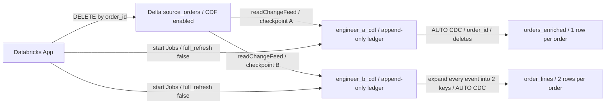

# Delta CDF deletion propagation demo

A minimal Databricks bundle with a synthetic Delta source, two independent Lakeflow
Spark Declarative Pipelines, and a Databricks App control centre. Delete a source
order, run each consumer, observe the deletion, and restore the example without a
full refresh.

Deploy the bundle in your own workspace to try the example. It creates
**1,000** deterministic orders by default in
**`<your_catalog>.<your_demo_schema>.source_orders`**. All datasets belong to the
bundle's dedicated schema, and the deployment helper prints your app's URL.

## How the design works



Each engineer has a separate pipeline, stream, and managed checkpoint. The first
CDF read emits the current source snapshot as inserts. Later updates read only
new change records. Each pipeline appends those records to its ledger and feeds
a temporary view into `dp.create_auto_cdc_flow`, using the source's Delta commit
version to order events. `update_preimage` rows are excluded from the current-state
output. `delete` rows are explicitly applied as deletes with SCD type 1.

Engineer B retains `order_id` on every derived row and expands **delete events too**.
Deleting order 42 therefore deletes both `(42, 1)` and `(42, 2)`. This example
uses a fixed expansion; more complex joins or changing child keys require their
own lineage/retraction logic.

The control centre displays source/output counts, pending event counts, selected
record presence, per-commit CDF ledger counts, and asynchronous Job progress.
The underlying pipeline event logs are also published in the demo schema.

## Deploy

You need:

- Python 3 and a recent Databricks CLI with Apps and bundles support.
- A Unity Catalog workspace with serverless Jobs, Lakeflow Spark Declarative
  Pipelines, and Databricks Apps available.
- An existing Unity Catalog catalog and SQL warehouse you can use.
- Permission to create the demo schema, Jobs, pipelines, and App, grant the App
  access to the warehouse and Jobs, and grant its service principal `USE_CATALOG`,
  `USE_SCHEMA`, `SELECT`, and `MODIFY` on the relevant demo resources.

### Configure your workspace

From this directory, replace the workspace URL, catalog, warehouse ID, and App
name below with values for your workspace. Use a new dedicated schema and a
workspace-unique App name. You can find the warehouse ID on its details page in
the Databricks workspace.

```bash
DEMO_WORKSPACE_URL="https://<your-workspace-host>"
DEMO_PROFILE="cdf-demo"
DEMO_CATALOG="your_catalog"
DEMO_SCHEMA="cdf_delete_demo"
DEMO_WAREHOUSE_ID="your_warehouse_id"
DEMO_APP_NAME="cdf-delete-demo-your-name"

databricks auth login --host "$DEMO_WORKSPACE_URL" --profile "$DEMO_PROFILE"

DEMO_VARS=(
  --var "catalog=$DEMO_CATALOG"
  --var "schema=$DEMO_SCHEMA"
  --var "warehouse_id=$DEMO_WAREHOUSE_ID"
  --var "app_name=$DEMO_APP_NAME"
  --var "seed_rows=1000"
)
```

If you already have an authenticated CLI profile for your workspace, set
`DEMO_PROFILE` to that profile and skip the login command. The examples use Bash
or Zsh arrays; run subsequent commands in the same shell so these settings remain
available. The checked-in configuration and helper scripts have workspace-specific
defaults, so always pass your profile and the variable overrides shown here.

| Variable | Value for your deployment | Purpose |
|---|---|---|
| `catalog` | Your existing catalog | UC catalog in which to create the schema |
| `schema` | `cdf_delete_demo` or another fresh name | Dedicated demo schema |
| `warehouse_id` | Your SQL warehouse ID | Warehouse used by the control centre |
| `app_name` | A workspace-unique name | Databricks App name |
| `seed_rows` | `1000` | 50–100,000 deterministic source rows |

Catalog/schema identifiers must start with a letter or underscore and contain
only letters, digits, and underscores. The walkthrough below assumes
`seed_rows=1000`; other sizes produce corresponding source/output counts.

### Deploy and initialize

```bash
python3 scripts/deploy.py \
  --profile "$DEMO_PROFILE" \
  --target dev \
  "${DEMO_VARS[@]}"
```

This validates and deploys the entire bundle, creates the new schema, initializes
the source and both consumers, grants the App access, and starts the App. Open
the control centre URL printed when it finishes. Initial serverless pipeline
startup can take several minutes. The deployment creates resources that incur
normal workspace compute charges when used.

The bundle declares the schema, both pipelines, all four control Jobs, the App,
and its warehouse/Job resource permissions. Source and baseline tables are created
by the bundled initialization notebook; consumer tables and event logs are created
by SDP. The deployment helper adds Unity Catalog permissions after app creation
and source initialization, avoiding a dependency cycle. It adds grants without
replacing existing principals' grants.

You can also edit the defaults in `databricks.yml` or use standard bundle variable
overrides such as `BUNDLE_VAR_catalog`. Reuse the same profile, target, and variables
on every command. Use a new schema/App name **and a distinct target or workspace root path**
for a second deployment you want to keep alongside the first; overriding variables
on the same target updates that deployment. Use a fresh schema when changing
`seed_rows`, because reset only restores missing records from the configured seed.

The target keeps predictable table names; pipelines themselves use development
mode. No development-mode schema prefix is applied.

## Walk through the example

1. Open the app. Initial counts: **source 1,000 / A 1,000 / B 2,000**.
2. Leave order ID **42** selected and click **Delete from source**.
3. Source becomes **999**. A remains **1,000**, B remains **2,000**.
4. Click **Run engineer A** and wait: A becomes **999**, B remains **2,000**.
5. Click **Run engineer B** and wait: B becomes **1,998**.
6. Inspect the evidence: each ledger received **one** new source event, rather
   than another 1,000 snapshot records. B generated two target-key deletions from it.
7. Run both again: no new source changes means no additional ledger records.
8. Click **Reset example**: source/A/B return to **1,000 / 1,000 / 2,000**.

Reset uses `MERGE ... WHEN NOT MATCHED THEN INSERT`, then runs both pipelines with
`full_refresh: false`. Reinstating order 42 creates one insert event per consumer.
It keeps the source table identity, Delta history, ledgers, and checkpoints intact.
The app starts a fresh observation round at the reset source version; historical
ledger entries stay visible. Reset is not a full-history purge.

## What the evidence proves

For a one-row deletion, a consumer ledger increases by **one**, historical commit
entries remain, and the current-state target shrinks correctly. The automated
integration check asserts those changes, consumer isolation, a no-op update, and
incremental reset. All control Jobs explicitly disable full refresh.

These counts measure **logical CDF events consumed**, not zero I/O or a guarantee
that Delta never rewrites files. Source DELETE may scan/rewrite source files and
AUTO CDC may rewrite target files. The app's observation queries also read tables.
Neither is a full source snapshot replay by the downstream pipelines.

The ledgers retain historical row values intentionally for this demonstration.
Deletion here means removal from current source and consumer results, not erasure
from Delta time travel, CDF retention, or audit records. Source retention is 30 days;
consumers must catch up before CDF data is removed. Do not routinely full-refresh
or rename flows: their names are associated with managed checkpoints.

## Verification

Local checks:

```bash
python3 -m venv .venv
.venv/bin/pip install -r src/app/requirements.txt
.venv/bin/python -m unittest discover -s tests -v
node --check src/app/static/app.js
databricks bundle validate --strict \
  --target dev --profile "$DEMO_PROFILE" "${DEMO_VARS[@]}"
```

The CLI's `databricks apps validate` currently requires a `package.json` project,
so it does not validate this Flask app. Use the Python tests, syntax checks, and
strict bundle validation above. The Spark pipeline graph and data semantics need
the real-workspace integration check below.

After deployment, run the real end-to-end check:

```bash
.venv/bin/python scripts/verify.py \
  --profile "$DEMO_PROFILE" --target dev "${DEMO_VARS[@]}"
```

This uses the same workspace and variables as your deployment. It
initializes/resets the **synthetic demo**, deletes ID 42, runs A before B, verifies
the ledger deltas and a no-op run, then restores the source. The check saves actual
observations to `test-results/integration.json` and leaves all rows restored.

By default this check runs the backend locally as the deployment user. To run the
same test through the deployed App, including the app service principal's DELETE
and Job permissions and the platform proxy's same-origin handling, use:

```bash
.venv/bin/python scripts/verify.py --deployed-app \
  --profile "$DEMO_PROFILE" --target dev "${DEMO_VARS[@]}"
```

That mode saves `test-results/app-integration.json`. The deployment helper provisions
the App's required grants.

## Source files

- `databricks.yml`: bundle variables, target and resource includes.
- `resources/`: schema, pipeline, Job and App definitions.
- `src/notebooks/restore_source.py`: deterministic source initialization/reset.
- `src/pipelines/engineer_a.py`: row-level CDF → AUTO CDC consumer.
- `src/pipelines/engineer_b.py`: one-to-many CDF → AUTO CDC consumer.
- `src/app/`: Flask control centre, plain HTML/CSS/JS, SDK-backed SQL and Jobs APIs.
- `scripts/deploy.py`: ordered deployment, grants, initialization and App start.
- `scripts/verify.py`: real-workspace integration check.

## Operating boundaries and cleanup

Use this as a single-presenter demo. The app blocks source mutations and overlapping
control actions while a demo Job is active. That is a usability guard, not a
distributed transaction lock across external clients; avoid manually starting
Jobs or mutating the source concurrently. Jobs and pipelines run as their deploying
owner. The app uses its own service principal, with SELECT on this dedicated schema,
MODIFY on the synthetic source, warehouse CAN_USE, and Job CAN_MANAGE_RUN. Keep App
access limited to people who should control the shared demo.

For a customer design, consumers should transform delete events deterministically,
keep stable unique source keys, define retention/catch-up policies, and preserve
lineage to every derived key. This example deliberately avoids aggregates, whose
corrections require additional logic.

When you finish, remove your bundle-managed resources using the same deployment
settings. Review the CLI's deletion prompt before confirming:

```bash
databricks bundle destroy \
  --target dev --profile "$DEMO_PROFILE" "${DEMO_VARS[@]}"
```

Managed source/baseline tables can prevent deleting a nonempty schema; inspect any
remaining tables and remove your dedicated demo schema separately if needed.
Do not drop a shared/customer schema.

Reference documentation:
- [Delta Change Data Feed](https://learn.microsoft.com/en-us/azure/databricks/delta/delta-change-data-feed)
- [AUTO CDC Python API](https://learn.microsoft.com/en-us/azure/databricks/ldp/developer/ldp-python-ref-apply-changes)
- [Databricks bundles](https://learn.microsoft.com/en-us/azure/databricks/dev-tools/bundles/)
- [Databricks Apps resources](https://learn.microsoft.com/en-us/azure/databricks/dev-tools/databricks-apps/resources)
